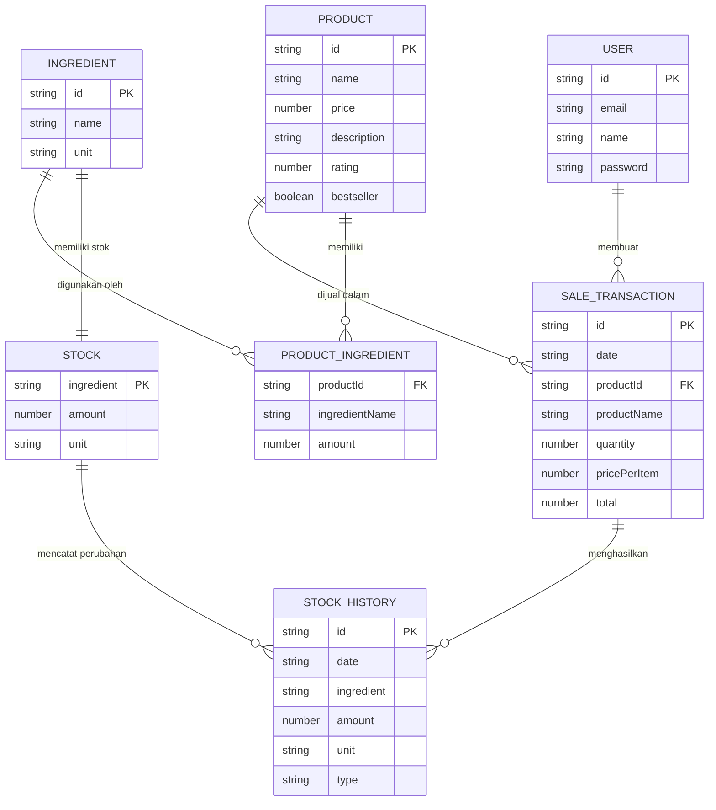

# 📊 Diagram Sistem MSP Coffee

Dokumen ini berisi Entity-Relationship Diagram (ERD) dan Use Case Diagram untuk sistem manajemen MSP Coffee.

---

## 📌 Entity-Relationship Diagram (ERD)

Diagram berikut menggambarkan struktur data dan hubungan antar entitas dalam sistem MSP Coffee.

### Penjelasan Entitas:

| Entitas | Deskripsi |
|---------|-----------|
| **USER** | Pengguna sistem (Admin/Kasir) yang dapat melakukan login dan mengelola transaksi |
| **PRODUCT** | Produk kopi yang dijual (Kopi Gula Aren, Spanish Latte, Honey Coffee) |
| **INGREDIENT** | Bahan baku yang digunakan untuk membuat produk (Biji Kopi, Susu, Sirup) |
| **PRODUCT_INGREDIENT** | Tabel relasi yang menyimpan resep/kebutuhan bahan per produk |
| **STOCK** | Stok bahan baku yang tersedia saat ini |
| **SALE_TRANSACTION** | Catatan transaksi penjualan |
| **STOCK_HISTORY** | Riwayat perubahan stok (Restock, Quick Add, Penjualan, Pengembalian) |

### Kardinalitas Relasi:

- **USER → SALE_TRANSACTION**: Satu user dapat membuat banyak transaksi (1:N)
- **PRODUCT → SALE_TRANSACTION**: Satu produk dapat ada di banyak transaksi (1:N)
- **PRODUCT → PRODUCT_INGREDIENT**: Satu produk memiliki banyak bahan baku (1:N)
- **INGREDIENT → STOCK**: Satu bahan memiliki satu record stok (1:1)
- **STOCK → STOCK_HISTORY**: Satu stok memiliki banyak riwayat perubahan (1:N)

---

## 🎯 Use Case Diagram

Diagram berikut menggambarkan interaksi antara aktor dengan sistem MSP Coffee.

```mermaid
flowchart TB
    subgraph Actors
        V((Visitor))
        U((User / Admin))
    end

    subgraph "MSP Coffee System"
        subgraph "Landing Page"
            UC1[Melihat Halaman Utama]
            UC2[Melihat Menu Produk]
            UC3[Melihat Galeri]
            UC4[Melihat Tim]
            UC5[Menghubungi Kontak]
        end

        subgraph "Authentication"
            UC6[Login]
            UC7[Register]
            UC8[Logout]
        end

        subgraph "Dashboard - Transaksi"
            UC9[Melihat Daftar Transaksi]
            UC10[Menambah Transaksi]
            UC11[Mengubah Transaksi]
            UC12[Menghapus Transaksi]
        end

        subgraph "Dashboard - Stok"
            UC13[Melihat Stok Bahan Baku]
            UC14[Menambah Stok / Restock]
            UC15[Quick Add Stok]
            UC16[Melihat Riwayat Stok]
        end

        subgraph "Dashboard - Laporan"
            UC17[Melihat Dashboard Overview]
            UC18[Melihat Grafik Penjualan]
            UC19[Melihat Laporan Penjualan]
            UC20[Export Laporan CSV]
        end

        subgraph "Dashboard - Produksi"
            UC21[Melihat Stok Tersedia]
            UC22[Kalkulasi Produksi Maksimal]
            UC23[Melihat Hasil Eliminasi Gauss]
        end
    end

    V --> UC1
    V --> UC2
    V --> UC3
    V --> UC4
    V --> UC5

    U --> UC6
    U --> UC7
    U --> UC8
    U --> UC9
    U --> UC10
    U --> UC11
    U --> UC12
    U --> UC13
    U --> UC14
    U --> UC15
    U --> UC16
    U --> UC17
    U --> UC18
    U --> UC19
    U --> UC20
    U --> UC21
    U --> UC22
    U --> UC23

    UC10 -.->|include| UC13
    UC11 -.->|include| UC13
    UC12 -.->|include| UC16
    UC22 -.->|include| UC21
```

### Deskripsi Aktor:

| Aktor | Deskripsi |
|-------|-----------|
| **Visitor** | Pengunjung yang belum login, hanya dapat mengakses landing page |
| **User/Admin** | Pengguna yang sudah terotentikasi, dapat mengakses semua fitur dashboard |

### Daftar Use Case:

#### 🏠 Landing Page (Public Access)
| No | Use Case | Deskripsi |
|----|----------|-----------|
| UC1 | Melihat Halaman Utama | Menampilkan hero section dan informasi coffee shop |
| UC2 | Melihat Menu Produk | Menampilkan daftar produk kopi yang dijual |
| UC3 | Melihat Galeri | Menampilkan galeri foto coffee shop |
| UC4 | Melihat Tim | Menampilkan informasi tim MSP Coffee |
| UC5 | Menghubungi Kontak | Mengakses halaman kontak |

#### 🔐 Authentication
| No | Use Case | Deskripsi |
|----|----------|-----------|
| UC6 | Login | Masuk ke sistem dengan email dan password |
| UC7 | Register | Mendaftar akun baru |
| UC8 | Logout | Keluar dari sistem |

#### 📊 Dashboard - Transaksi (CRUD)
| No | Use Case | Deskripsi |
|----|----------|-----------|
| UC9 | Melihat Daftar Transaksi | Menampilkan semua transaksi penjualan |
| UC10 | Menambah Transaksi | Membuat transaksi penjualan baru |
| UC11 | Mengubah Transaksi | Mengubah kuantitas transaksi |
| UC12 | Menghapus Transaksi | Menghapus transaksi dan mengembalikan stok |

#### 📦 Dashboard - Stok Bahan Baku
| No | Use Case | Deskripsi |
|----|----------|-----------|
| UC13 | Melihat Stok Bahan Baku | Menampilkan stok kopi, susu, dan sirup |
| UC14 | Menambah Stok / Restock | Menambah stok bahan baku secara manual |
| UC15 | Quick Add Stok | Menambah stok dengan jumlah preset |
| UC16 | Melihat Riwayat Stok | Menampilkan history perubahan stok |

#### 📈 Dashboard - Laporan
| No | Use Case | Deskripsi |
|----|----------|-----------|
| UC17 | Melihat Dashboard Overview | Menampilkan statistik ringkasan |
| UC18 | Melihat Grafik Penjualan | Menampilkan chart penjualan bulanan |
| UC19 | Melihat Laporan Penjualan | Menampilkan laporan detail penjualan |
| UC20 | Export Laporan CSV | Mengunduh laporan dalam format CSV |

#### 🧮 Dashboard - Kalkulasi Produksi
| No | Use Case | Deskripsi |
|----|----------|-----------|
| UC21 | Melihat Stok Tersedia | Menampilkan ketersediaan bahan baku |
| UC22 | Kalkulasi Produksi Maksimal | Menghitung jumlah produksi optimal |
| UC23 | Melihat Hasil Eliminasi Gauss | Menampilkan hasil perhitungan dengan metode Gauss |

---

## 📝 Catatan Teknis

### Teknologi yang Digunakan:
- **Frontend**: Nuxt 3, Vue 3, TailwindCSS
- **State Management**: Pinia
- **Algoritma**: Eliminasi Gauss untuk kalkulasi produksi
- **Visualisasi**: Chart.js untuk grafik penjualan

### Produk yang Tersedia:
1. **Kopi Gula Aren** - Rp 19.000
2. **Spanish Latte** - Rp 19.000
3. **Honey Coffee** - Rp 19.000

### Tipe Perubahan Stok:
- `Restock` - Penambahan stok manual
- `Quick Add` - Penambahan stok preset
- `Penjualan` - Pengurangan stok karena transaksi
- `Pengembalian` - Pengembalian stok karena pembatalan transaksi
